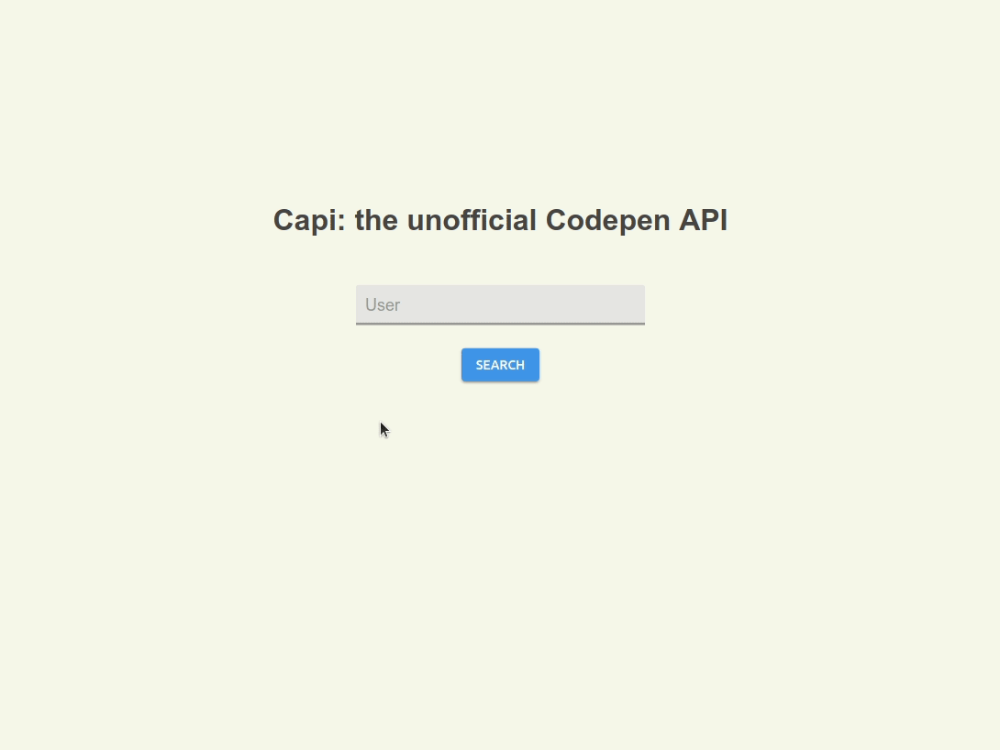

<p align="center">
    
  <br>
  <a href="https://travis-ci.org/lucagez/capi"></a>
  <a href="https://www.npmjs.org/package/capi.js"></a>
  
  
  
</p>

# Capi
> The unofficial Codepen.io API


## How it works

- Uses ```node-fetch``` to request data relative to the users.
- Parse the response with ```cheerio```.
- Make use of ```promises``` to fetch pages synchronously.

## Demo

#### codepen (with front-end):

https://codepen.io/lucagez/full/GPNJdE

#### glitch (api only):

- server ➡️ https://glitch.com/edit/#!/capi
- query ➡️ https://capi.glitch.me/api?user={YOURUSERNAME}

## Installation

```sh
npm install --save capi.js
```

## Usage 

```javascript
const Capi = require('capi.js');

(async () => {
    const username = 'lucagez';

    // options:
    const maxPagesToFetch = 5 // if not set, Capi will continue to fetch pens until the very last one
    const order = 'latest' // defaults to 'popular'
    // const user = new Capi(username, maxPagesToFetch, order);
    
    const user = new Capi(username);
    const userData = await user.get();

    console.log(userData)
    // => object
    // [{
    //  title: "pen1", 
    //  views: 2000, 
    //  hearts: 200, 
    //  comments: 20}, 
    //  { other object }, 
    //  ...]
})();
```

## Api

Capi accepts the following arguments:

| argument   |      type     |  description  | required |
|------------|:-------------:|:--------------|---------:|
| user       | string        | Username      | **yes**  |
| max        | number        | Max pages to fetch before stopping execution. If not set, Capi will simply continue to fetch pens until the very last one. | **no**  |
| order      | string        | Can be equal to ```popular``` or ```latest```. Indicates the order with which the pens are retrieved. | **no**  |

## License

Licensed under the MIT license.
